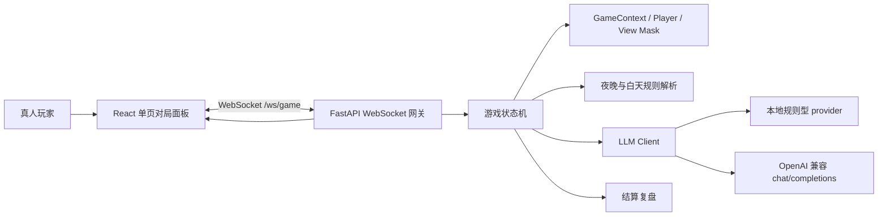

# Werewolf

<p align="center">
  <strong>一个单机 9 人局 AI 狼人杀：1 名真人玩家，与 8 名 AI 玩家同桌博弈。</strong>
</p>

<p align="center">
  
  
  
  
  
</p>

<p align="center">
  <a href="#为什么是-werewolf">项目简介</a>
  · <a href="#功能亮点">功能亮点</a>
  · <a href="#快速开始">快速开始</a>
  · <a href="#真实模型接入">模型接入</a>
  · <a href="#系统架构">系统架构</a>
  · <a href="#开发命令">开发命令</a>
</p>

## 为什么是 Werewolf

Werewolf 是一个面向本地运行的 AI 狼人杀实验项目。它把狼人杀的夜晚行动、白天发言、投票放逐、猎人开枪和终局复盘放进一套 FastAPI WebSocket 状态机里，再由 React 前端呈现为单屏对局面板。

你不需要凑齐真人玩家，也不必先准备模型密钥。默认情况下，后端会使用本地规则型 AI provider，开箱即可跑完整局；当配置 OpenAI 兼容的 `chat/completions` 服务后，AI 玩家会切换为真实模型驱动。

## 功能亮点

- **秒开 9 人局**：固定板子为 3 狼人、3 平民、预言家、女巫、猎人，随机分配 1 名真人与 8 名 AI。
- **完整状态机**：覆盖入夜、狼人击杀、预言家查验、女巫用药、天亮结算、遗言、发言、投票、放逐、猎人开枪与胜负判定。
- **真人行动等待**：真人玩家作为狼人、预言家、女巫、猎人或普通投票者时，前端会动态解锁合法操作。
- **实时对局 UI**：玩家状态、局内日志、AI 思考中、操作面板、投票票型、结算复盘集中在一个页面内。
- **本地与真实模型双模式**：未配置密钥时使用规则型 provider；配置后使用 OpenAI 兼容 provider，并保留 JSON mode 与兼容重试路径。
- **终局复盘**：游戏结束时揭示所有身份，并汇总夜间因果、白天发言、票型、关键事件和完整时间线。
- **开发友好**：后端 pytest、前端 Vitest/Testing Library、协议类型镜像、Trellis 项目规范已就位。

## 快速开始

### 环境要求

- Python `>= 3.11`
- Node.js `>= 18`
- Windows PowerShell、macOS/Linux shell 均可；下面示例使用 PowerShell。

### 1. 启动后端

```powershell
python -m pip install -e .[dev]
python -m uvicorn app.main:app --app-dir backend --reload
```

后端默认运行在 `http://localhost:8000`。

- 健康检查：`GET /health`
- 游戏 WebSocket：`GET /ws/game`

### 2. 启动前端

另开一个终端：

```powershell
npm install --prefix frontend
npm run dev --prefix frontend
```

打开 `http://127.0.0.1:5573` 开始对局。前端会根据当前页面的 hostname 连接 `ws://<hostname>:8000/ws/game`，因此开发时后端需要运行在 `8000` 端口。

### 3. 玩一局

进入页面后会自动创建新局。你会收到自己的座位号和身份；当轮到你发言、投票或使用技能时，底部操作面板会切换到对应输入状态。游戏结束后，结算面板会展示阵营胜负与全局复盘。

## 真实模型接入

默认不配置任何模型变量时，Werewolf 使用本地规则型 provider。只要配置了任意模型相关变量，后端就会进入 OpenAI 兼容 provider 校验：缺少密钥或模型名会直接报错，避免静默退回本地规则。

| 变量 | 说明 | 默认值 |
| --- | --- | --- |
| `OPENAI_API_KEY` 或 `STITCH_API_KEY` | 模型服务密钥；启用真实模型时必填 | 无 |
| `OPENAI_MODEL` 或 `STITCH_MODEL` | 模型名；启用真实模型时必填 | 无 |
| `OPENAI_BASE_URL` 或 `STITCH_BASE_URL` | OpenAI 兼容服务 base URL，也可直接指向 `/chat/completions` | `https://api.openai.com/v1` |
| `OPENAI_TIMEOUT_SECONDS` 或 `STITCH_TIMEOUT_SECONDS` | 单次模型请求超时时间 | `30` |
| `OPENAI_ALLOW_LOCALHOST` 或 `STITCH_ALLOW_LOCALHOST` | 允许连接 localhost / 私有网段，用于 Ollama、LiteLLM 等本地服务 | 未开启 |

PowerShell 示例：

```powershell
$env:OPENAI_API_KEY = "sk-..."
$env:OPENAI_MODEL = "gpt-4.1-mini"
$env:OPENAI_BASE_URL = "https://api.openai.com/v1"
$env:OPENAI_TIMEOUT_SECONDS = "30"
python -m uvicorn app.main:app --app-dir backend --reload
```

出于 SSRF 防护考虑，模型 base URL 默认不能指向 `localhost`、`127.0.0.1`、`::1` 或私有网段。接入 Ollama 等本地服务时，请显式开启：

```powershell
$env:OPENAI_ALLOW_LOCALHOST = "true"
$env:OPENAI_BASE_URL = "http://localhost:11434/v1"
$env:OPENAI_API_KEY = "ollama"
$env:OPENAI_MODEL = "qwen2.5:7b"
```

更多本地模型说明见 [docs/ollama_setup.md](docs/ollama_setup.md)。

## 游戏规则

- **人数与身份**：9 人局，包含 3 狼人、3 平民、预言家、女巫、猎人。
- **胜负判定**：屠边局；狼人全灭则好人胜，平民全灭或神职全灭则狼人胜。
- **夜晚行动**：狼人击杀、预言家查验、女巫救人或毒人。女巫不能自救，每晚最多使用一瓶药。
- **白天流程**：宣布死讯后依次发言，随后投票放逐。平票不进入 PK，直接无人出局。
- **猎人规则**：猎人被狼刀或投票出局时可以开枪；被女巫毒死时不能开枪。
- **真人狼人目标**：真人狼人夜晚可选择任一存活玩家，包括自己和狼队友，用于保留自刀、卖队友、苦肉计等玩法空间。

## 系统架构



核心分层：

```text
backend/app/
  main.py          FastAPI app、CORS、健康检查
  domain/          玩家、上下文、视角遮罩等纯领域模型
  engine/          状态机、夜晚行动、白天发言、投票与胜负规则
  llm/             Prompt、结构化输出、provider、fallback
  protocols/       WebSocket C2S / S2C Pydantic 合约
  services/        对局初始化等应用服务
  ws/              WebSocket 会话、消息构造、人类输入桥接

frontend/src/
  App.tsx          页面壳、连接生命周期、全局组合
  components/      玩家列表、日志、操作面板、票型、复盘等 UI
  state/           reducer 与 server envelope 到视图状态的转换
  types/           WebSocket 协议 TypeScript 镜像
  ws/              WebSocket URL、重连与连接状态工具
  copy.ts          面向玩家的中文文案与常量翻译
```

## WebSocket 协议速览

服务端推送：

- `SYSTEM_MSG`：系统消息
- `CHAT_UPDATE`：公开或私有发言/日志
- `AI_THINKING`：AI 思考状态
- `PLAYER_STATE_PATCH`：玩家状态增量更新
- `PHASE_CHANGED`：游戏阶段变化
- `DEATH_REVEALED`：夜晚死亡公布
- `VOTE_RESOLVED`：投票结果
- `REQUIRE_INPUT`：要求真人提交行动
- `GAME_OVER`：终局与复盘

客户端提交：

- `SUBMIT_ACTION`：提交发言、投票、狼人击杀、预言家查验、女巫用药、猎人开枪或跳过。

协议定义分别位于 [backend/app/protocols](backend/app/protocols) 与 [frontend/src/types/ws.ts](frontend/src/types/ws.ts)。

## 开发命令

| 场景 | 命令 |
| --- | --- |
| 安装后端开发依赖 | `python -m pip install -e .[dev]` |
| 启动后端 | `python -m uvicorn app.main:app --app-dir backend --reload` |
| 后端测试 | `python -m pytest -q` |
| 安装前端依赖 | `npm install --prefix frontend` |
| 启动前端 | `npm run dev --prefix frontend` |
| 前端测试 | `npm run test --prefix frontend` |
| 前端构建 | `npm run build --prefix frontend` |
| 根目录启动前端 | `npm run dev` |
| 根目录前端测试 | `npm run test` |
| 根目录前端构建 | `npm run build` |

根目录 `package.json` 只转发前端脚本；后端服务仍使用 `uvicorn` 命令启动。

## 项目文档

- [docs/需求.md](docs/需求.md)：产品愿景、规则基线与验收标准
- [docs/技术.md](docs/技术.md)：技术方案、WebSocket payload 与 LLM 结构化输出设计
- [docs/状态机架构.md](docs/状态机架构.md)：核心状态机、阶段流转与上下文结构
- [docs/ollama_setup.md](docs/ollama_setup.md)：本地 Ollama 接入指南
- [docs/exa调研.md](docs/exa调研.md)：规则、AI 策略和 WebSocket 可靠性调研备忘

## 路线图

- [x] 固定 9 人局初始化与身份分配
- [x] 后端状态机与 WebSocket 实时推送
- [x] 真人发言、投票、夜晚技能与猎人开枪输入
- [x] 本地规则型 AI provider 与 OpenAI 兼容 provider
- [x] 前端单页对局面板、票型与结算复盘
- [ ] 断线恢复与对局存档
- [ ] 可配置板子、角色与发言规则
- [ ] 更丰富的 AI 人设、长期记忆与策略评估
- [ ] Docker / 一键启动脚本

## 贡献

这个仓库使用 Trellis 管理项目规范、任务上下文与开发记忆。开始改动前，请优先阅读：

- [AGENTS.md](AGENTS.md)
- [.trellis/workflow.md](.trellis/workflow.md)
- [.trellis/spec](.trellis/spec)

建议贡献流程：

1. 先用 `rg` 搜索相关协议、文案或状态流转，确认所有调用点。
2. 后端协议变更时，同步更新 `frontend/src/types/ws.ts` 与前后端测试。
3. 前端用户可见文案集中放在 `frontend/src/copy.ts`。
4. 提交前至少运行与改动相关的测试；跨层改动建议同时运行后端测试、前端测试与前端构建。

## 许可证

当前仓库尚未声明许可证。若计划公开分发或被第三方复用，请先补充 `LICENSE`。
